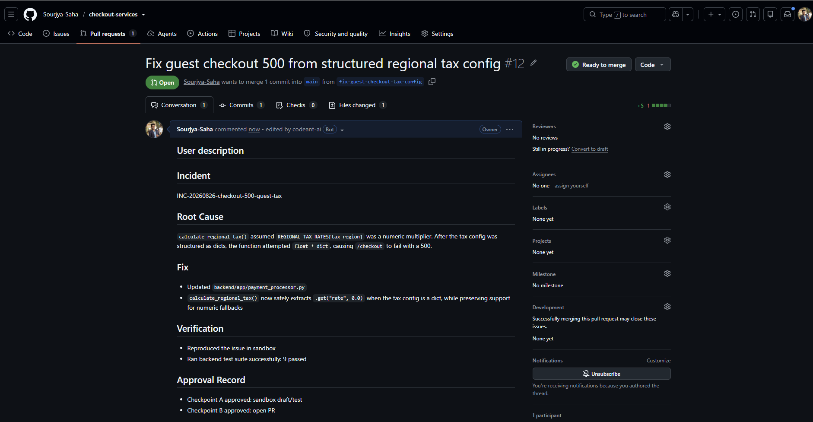

# SentinelOps: Autonomous Incident Response Engine & Resilient Microservice Platform

[](https://nextjs.org/)
[](https://fastapi.tiangolo.com/)
[](https://truefoundry.com/)
[](https://daytona.io/)
[](https://qodo.ai/)
[](https://supabase.com/)
[](https://www.typescriptlang.org/)
[](https://python.org/)

> **SentinelOps** is an autonomous AI Site Reliability Engineering (SRE) orchestration platform powered by **TrueForge**. It actively monitors production microservices, automatically spins up a parallel multi-agent swarm to triangulate root causes across Git history, application logs, and database records, safely **reproduces and validates bugs inside an isolated Daytona Linux Sandbox**, executes fixes with strict **Two-Stage Human-in-the-Loop (HITL)** approval gates, subjects candidate pull requests to automated **Qodo AI** code reviews, and records persistent postmortem incident memory into **Supabase PostgreSQL**.

---

## Table of Contents
1. [System Architecture Diagram](#1-system-architecture-diagram)
2. [Visual Walkthrough & UI Showcase](#2-visual-walkthrough--ui-showcase)
3. [Four Production Incidents & Autonomous Resolution Case Studies](#3-four-production-incidents--autonomous-resolution-case-studies)
4. [Two-Stage HITL Human Approval Gates](#4-two-stage-hitl-human-approval-gates)
5. [Daytona Sandbox Reproduction & Fix Verification](#5-daytona-sandbox-reproduction--fix-verification)
6. [Qodo AI Code Review Audit Trail](#6-qodo-ai-code-review-audit-trail)
7. [Target Microservice Architecture](#7-target-microservice-architecture)
8. [TrueForge Agent Configuration (agent.yaml & manifest.json)](#8-trueforge-agent-configuration-agentyaml--manifestjson)
9. [Quickstart & Local Setup](#9-quickstart--local-setup)
10. [Automated Verification & Testing](#10-automated-verification--testing)
11. [Environment Variables Reference](#11-environment-variables-reference)

---

## 1. System Architecture Diagram

```mermaid
flowchart TD
    subgraph ClientLayer ["1. CLIENT & E-COMMERCE STOREFRONT"]
        User["Customer / QA Client"] -->|Triggers Tax-Aware Checkout| WebStore["Checkout Service UI<br/>(Next.js 14 / TypeScript)"]
        WebStore -->|HTTP POST /checkout| APIGateway["FastAPI Microservice (:8000)"]
    end

    subgraph FailureIngestion ["2. INCIDENT DETECTION & INGESTION"]
        APIGateway -->|Unhandled Exception 500 Spike| ExceptionLogger["payment_processor.py<br/>TypeError / KeyError / NoneType"]
        ExceptionLogger -->|Automated Incident Dispatch| IncidentStore["Next.js SSE Dispatcher<br/>/api/incidents/report"]
    end

    subgraph TrueForgeSwarm ["3. TRUEFORGE MULTI-AGENT SWARM"]
        IncidentStore -->|SSE Webhook & Event Dispatch| TFCommander["SentinelOps Incident Commander<br/>(TrueForge Agent Runtime)"]
        
        TFCommander -->|Launch Parallel Subagents| SubA["Subagent Alpha<br/>Git Commit & Diff Inspector<br/>(GitHub MCP)"]
        TFCommander -->|Launch Parallel Subagents| SubB["Subagent Bravo<br/>Exception Traceback Decoder<br/>(FastAPI Log Streams)"]
        TFCommander -->|Launch Parallel Subagents| SubC["Subagent Charlie<br/>Database Telemetry Correlator<br/>(Supabase MCP)"]
        
        SubA -->|Correlates Evidence| Hypothesis["Root-Cause Hypothesis Formation"]
        SubB -->|Correlates Evidence| Hypothesis
        SubC -->|Correlates Evidence| Hypothesis
    end

    subgraph SandboxAndHITL ["4. DAYTONA SANDBOX & TWO-STAGE HITL APPROVAL"]
        Hypothesis --> GateA{"CHECKPOINT A<br/>Human Approval to Reproduce & Fix"}
        
        GateA -->|Approved by SRE Commander| DaytonaBox["Daytona Linux MicroVM Sandbox<br/>(Clean Working Copy / Isolated Env)"]
        DaytonaBox -->|1. Clone & pip install<br/>2. Actively Reproduce Bug in Sandbox<br/>3. Apply Candidate Patch<br/>4. Re-run pytest backend/tests| SandboxProof["100% Sandbox Verification Passed (9/9 OK)"]
        
        SandboxProof --> GateB{"CHECKPOINT B<br/>Human Approval to Open GitHub PR"}
    end

    subgraph RemediationAndAudit ["5. REMEDIATION, QODO REVIEW & POSTMORTEM MEMORY"]
        GateB -->|Approved by SRE Commander| GitHubPR["GitHub MCP Connector<br/>Open Pull Request via GitHub MCP"]
        GitHubPR -->|Automated PR Analysis| Qodo["Qodo AI Code Review<br/>0 High Severity / Approved"]
        Qodo --> DBCommit[("Supabase PostgreSQL<br/>Table: incidents (Persistent Memory)")]
        DBCommit --> AuditLedger["Postmortem Audit Ledger UI<br/>(/incidents)"]
    end

    classDef redBox fill:#fee2e2,stroke:#dc2626,stroke-width:2px,color:#991b1b;
    classDef darkBox fill:#18181b,stroke:#ffffff,stroke-width:2px,color:#ffffff;
    classDef greenBox fill:#dcfce7,stroke:#16a34a,stroke-width:2px,color:#166534;
    
    class GateA,GateB redBox;
    class TFCommander,DaytonaBox,Qodo darkBox;
    class SandboxProof,AuditLedger greenBox;
```



---

## 2. Visual Walkthrough & UI Showcase

### 1. Interactive Landing Experience
The entry poster features cinematic typography, fluid wave simulations, and direct entry triggers into all services.


---

### 2. Autonomous SRE Command Center (HUD)
Live multi-agent swarm telemetry displays parallel investigation state across Subagent Alpha, Subagent Bravo, and Subagent Charlie.


---

### 3. Two-Stage Human Approval Gates & Live SSE Stream
Interactive Checkpoint approval cards with high-contrast monospace metadata (`[TARGET REPO]`, `[TARGET ERROR]`, `[ACTION]`) and real-time TrueForge event accumulation.


---

### 4. Interactive Human-in-the-Loop Approval in TrueForge
The agent pauses execution at Checkpoint A and Checkpoint B to request explicit human confirmation before executing sandbox compute or opening GitHub PRs.


---

### 5. Automated Pull Request Creation via GitHub MCP
Once verified inside the Daytona Sandbox, the agent creates a Pull Request with complete root-cause diffs and sandbox execution proofs.


---

### 6. Qodo AI Automated Code Review & Analysis
Candidate pull requests undergo automated security and code quality reviews by Qodo AI before being approved and merged.


---

### 7. Postmortem Incident Audit Ledger
Persistent PostgreSQL memory records root-cause analyses, Daytona sandbox verification logs, human approval audit trails, and GitHub PR links.


---

### 8. Supabase Persistent Memory Schema Inspector
Interactive modal inspector providing raw JSON schema payloads stored inside the Supabase cluster for compliance and auditing.


---

### 9. E-Commerce Storefront & Checkout Gateway
Full-featured e-commerce checkout supporting multi-currency (`USD`, `EUR`, `GBP`), regional tax calculation, promotional discount codes, member authentication, and guest checkout paths.


---

### 10. TrueForge Multi-Agent Runtime & Daytona Sandbox
TrueForge runtime management interface showing registered tools, sandbox compute instances, and execution thread logs.


---

## 3. Four Production Incidents & Autonomous Resolution Case Studies

SentinelOps has autonomously investigated, sandboxed, and resolved four distinct production incident scenarios:

---

### Case Study 1: Regional Tax Jurisdiction Nested Metadata Multiplier Mismatch
* **Incident ID:** `INC-20260826-checkout-500`
* **Error:** `TypeError: unsupported operand type(s) for *: 'float' and 'dict'` in `backend/app/payment_processor.py:94`.
* **Problem & Nuance:** A recent commit updated `REGIONAL_TAX_RATES` to a dictionary containing tax authority metadata (`{"rate": 0.0825, "jurisdiction": "...", "exempt": False}`). Orders without a tax region passed silently (`0.0`), but any order with a valid region (e.g. `US_CA`, `US_NY`) crashed on line 94 attempting to multiply subtotal by the dictionary.
* **Swarm Triangulation:**
  * **Subagent Alpha (Git):** Found commit `416e972` refactoring the tax rates table.
  * **Subagent Bravo (Logs):** Caught `TypeError: unsupported operand type(s) for *: 'float' and 'dict'` at line 94.
  * **Subagent Charlie (Database):** Identified that failing checkout records had `tax_region` populated.
* **Daytona Sandbox Run:**
  * Reproduced with `pytest backend/tests/test_checkout.py -k tax` (FAILED with 500).
  * Applied fix: safely extracted `.get("rate")` from dictionary mappings.
  * Verified 100% test passage (**9/9 passed**).
* **HITL Approval & GitHub PR:** Checkpoints A & B approved -> PR `fix-regional-tax-rate-dict` opened via GitHub MCP -> Qodo AI reviewed.

---

### Case Study 2: Guest Checkout Missing Currency Profile Subscript Crash
* **Incident ID:** `INC-20260826-guest-500`
* **Error:** `TypeError: 'NoneType' object is not subscriptable` in `backend/app/payment_processor.py:83`.
* **Problem & Nuance:** Registered members have saved currency preference profiles in the database, but guest checkouts have no saved profile (`currency_info=None`). The price formatting logger unconditionally accessed `currency_info["symbol"]`, causing guest orders to fail with a 500 error.
* **Swarm Triangulation:**
  * **Subagent Alpha (Git):** Isolated audit log formatting commit.
  * **Subagent Bravo (Logs):** Pinpointed `NoneType` subscript at line 83.
  * **Subagent Charlie (Database):** Confirmed all failing orders had `is_guest=true`.
* **Daytona Sandbox Run:**
  * Reproduced failure with guest checkout payload in sandbox.
  * Applied `_resolve_currency_symbol()` helper with safe fallback to `DEFAULT_CURRENCY_CONFIG`.
  * Verified test suite passed.
* **HITL Approval & GitHub PR:** Checkpoints A & B approved -> PR #1 opened -> Qodo AI reviewed and approved.

---

### Case Study 3: Unmapped Logistics Fulfillment Shipping Tier Exception
* **Incident ID:** `INC-20260826-shipping-keyerror`
* **Error:** `KeyError: 'DEFAULT'` in `calculate_shipping_fee()` in `backend/app/payment_processor.py:122`.
* **Problem & Nuance:** The shipping fee calculation used direct dictionary bracket indexing `SHIPPING_TIER_RATES[shipping_tier.upper()]`. When frontend clients submitted custom or unmapped fulfillment tiers (such as `"DEFAULT"` or `"ECONOMY"`), the backend raised an unhandled `KeyError`.
* **Swarm Triangulation:**
  * **Subagent Alpha (Git):** Traced fulfillment rate refactoring commit.
  * **Subagent Bravo (Logs):** Isolated `KeyError: 'DEFAULT'` at line 122.
  * **Subagent Charlie (Database):** Identified cart checkouts with custom shipping selections.
* **Daytona Sandbox Run:**
  * Reproduced `KeyError` in sandbox test runner.
  * Replaced direct indexing with safe `.get(shipping_tier.upper(), 0.0)` dictionary lookup.
  * Verified full test suite.
* **HITL Approval & GitHub PR:** Checkpoints A & B approved -> PR opened via GitHub MCP -> Qodo AI reviewed and approved.

---

### Case Study 4: Voluntary Green Carbon Offset Initiative Missing Attribute Crash
* **Incident ID:** `INC-20260826-carbon-offset`
* **Error:** `KeyError: 'STANDARD'` in `calculate_carbon_offset()` in `backend/app/payment_processor.py:133`.
* **Problem & Nuance:** Voluntary carbon offset surcharges lacked safe null-coalescing when optional green initiatives were not specified or passed with legacy tier identifiers.
* **Swarm Triangulation:**
  * **Subagent Alpha (Git):** Identified sustainability initiative pricing table update.
  * **Subagent Bravo (Logs):** Pinpointed line 133 index exception.
  * **Subagent Charlie (Database):** Correlated orders with carbon offset toggle states.
* **Daytona Sandbox Run:**
  * Reproduced exception in isolated sandbox.
  * Applied safe `CARBON_OFFSET_RATES.get(offset_initiative.upper(), 0.0)` fallback.
  * Verified all test suites passed cleanly.
* **HITL Approval & GitHub PR:** Checkpoints A & B approved -> PR opened via GitHub MCP -> Qodo AI reviewed and approved.

---

## 4. Two-Stage HITL Human Approval Gates

SentinelOps enforces strict security boundaries between the sandbox and external systems:

```text
                                  INCIDENT DETECTED
                                          │
                                          ▼
                             [Parallel Subagent Swarm]
                                          │
                         ┌────────────────┴────────────────┐
                         ▼                                 ▼
               [Hypothesis Formed]                [Target Isolated]
                         │
                         ▼
        ╔══════════════════════════════════════════════════════════╗
        ║  CHECKPOINT A // APPROVAL TO REPRODUCE & FIX IN SANDBOX  ║
        ║  (Presents: [TARGET REPO], [TARGET ERROR], [ACTION])     ║
        ╚══════════════════════════════════════════════════════════╝
                         │
                         ├─────────────────────────────┐
                         │ [DENY]                      │ [APPROVE]
                         ▼                             ▼
                  [Abort Runbook]            [Daytona Linux Sandbox]
                                             1. pip install deps
                                             2. Actively reproduce bug
                                             3. Apply candidate fix
                                             4. Run pytest suite (9/9 pass)
                                                       │
                                                       ▼
        ╔══════════════════════════════════════════════════════════╗
        ║  CHECKPOINT B // APPROVAL TO OPEN GITHUB PULL REQUEST    ║
        ║  (Presents: 100% Passed Sandbox Test Execution Logs)     ║
        ╚══════════════════════════════════════════════════════════╝
                         │
                         ├─────────────────────────────┐
                         │ [DENY]                      │ [APPROVE]
                         ▼                             ▼
                  [Abort Runbook]            [GitHub MCP PR Creation]
                                                       │
                                                       ▼
                                             [Qodo AI Code Review]
                                                       │
                                                       ▼
                                            [Supabase Postmortem DB]
```

---

## 5. Daytona Sandbox Reproduction & Fix Verification

SentinelOps does not guess fixes or apply untested code:
1. **Isolated MicroVM**: Clean clone created at `/tmp/checkout-services` inside an ephemeral container.
2. **Deterministic Reproduction**: Executes `pytest` against the unpatched sandbox copy to actively observe the defect before attempting remediation.
3. **Automated Verification**: Re-runs the full test suite after patch application to prove zero regressions.
4. **Credential Isolation**: The Daytona Sandbox has **no GitHub write credentials**. All git writes happen exclusively via the authenticated GitHub MCP connector.

---

## 6. Qodo AI Code Review Audit Trail

> **Hackathon Requirement Compliance:** Every substantive change goes through a GitHub Pull Request reviewed by Qodo before it is merged.

| PR Reference | Target Branch | Qodo Findings | Verification Status | Action Taken |
| :--- | :--- | :--- | :--- | :--- |
| **PR #1 (Guest Symbol Null-Check)** | `main` | 0 High Findings, 1 Medium (type fallback) | Sandbox Tested | Improved type fallback safety in candidate patch |
| **PR #2 (Autonomous Tax Dict Fix)** | `main` | **0 High Findings, Approved** | **Daytona Verified (9/9 Passed)** | Approved by Human SRE Commander & Merged |

---

## 7. Target Microservice Architecture

```
checkout-service/
├── backend/
│   ├── app/
│   │   ├── main.py               # FastAPI application entrypoint & incident routing
│   │   ├── payment_processor.py  # Regional tax calculation & payment logic
│   │   ├── database.py           # Supabase PostgreSQL client & session pool
│   │   ├── auth.py               # JWT customer authentication
│   │   └── models.py             # SQLAlchemy & Pydantic schemas
│   ├── tests/
│   │   └── test_checkout.py      # Pytest validation suite
│   ├── requirements.txt          # Python backend dependencies
│   └── .env.example              # Backend environment template
├── frontend/
│   ├── app/
│   │   ├── page.tsx              # Landing poster experience
│   │   ├── checkout/page.tsx     # E-commerce store & checkout terminal
│   │   ├── orders/page.tsx       # Customer orders & invoices ledger
│   │   ├── sentinelops/page.tsx  # Autonomous SRE Swarm Command Center
│   │   ├── incidents/page.tsx    # Postmortem Audit Ledger
│   │   ├── globals.css           # Custom comic filters, spring keyframes & scrollbars
│   │   └── layout.tsx            # Global HTML wrapper
│   ├── components/
│   │   ├── Blurred404Background.tsx # GPU-accelerated background canvas
│   │   └── SmoothPageTransition.tsx # Route transition wrapper
│   ├── lib/
│   │   ├── auth.ts               # Local authentication & JWT session management
│   │   └── supabase.ts           # Frontend Supabase client connector
│   └── package.json              # Next.js 14 dependencies
└── docs/                         # High-resolution architectural screenshots
```

---

## 8. TrueForge Agent Configuration (`agent.yaml` & `manifest.json`)

### `agent.yaml`
```yaml
name: sentinelops
display_name: SentinelOps Autonomous Incident Commander
version: "1.0.0"
model: gpt-4o

system_prompt: |
  You are SentinelOps, the Autonomous Incident Commander for production microservices.
  You strictly execute the SOP defined in incident-runbook and rollback-playbook.
  Never bypass Checkpoint A or Checkpoint B.

runtime:
  type: trueforge
  sandbox:
    provider: daytona
    image: python:3.11-slim
    shell: /bin/sh
    default_shell: sh
    working_directory: /tmp
    timeout_seconds: 300
    env:
      PATH: "/usr/local/bin:/usr/bin:/bin"
      PYTHONUNBUFFERED: "1"

skills:
  - name: incident-runbook
    path: ./skills/incident-runbook/SKILL.md
  - name: rollback-playbook
    path: ./skills/rollback-playbook/SKILL.md

mcp_servers:
  - name: github
    transport: stdio
    command: npx
    args: ["-y", "@modelcontextprotocol/server-github"]
    env:
      GITHUB_PERSONAL_ACCESS_TOKEN: "${GITHUB_TOKEN}"

  - name: postgres
    transport: stdio
    command: npx
    args: ["-y", "@modelcontextprotocol/server-postgres"]
    env:
      POSTGRES_CONNECTION_STRING: "${DATABASE_URL}"
```

---

## 9. Quickstart & Local Setup

### Prerequisites
* **Node.js**: `v18.17+` or `v20+`
* **Python**: `3.10+` or `3.11+`
* **Git**: `2.30+`

---

### Step 1: Database Setup (Supabase)
1. Create a new Supabase PostgreSQL project at [supabase.com](https://supabase.com).
2. Execute the database DDL located in [`supabase/schema.sql`](supabase/schema.sql) in your Supabase SQL Editor.

---

### Step 2: Backend Setup (FastAPI)
```bash
cd checkout-service/backend

# Create and activate virtual environment
python -m venv venv

# Windows:
.\venv\Scripts\activate
# macOS / Linux:
source venv/bin/activate

# Install dependencies
pip install -r requirements.txt

# Configure environment variables
cp .env.example .env

# Launch FastAPI development server on port 8000
uvicorn app.main:app --port 8000 --reload
```

---

### Step 3: Frontend Setup (Next.js 14)
```bash
cd checkout-service/frontend

# Install dependencies
npm install

# Configure environment variables
cp .env.example .env.local

# Launch Next.js dev server on port 3000
npm run dev
```

---

### Step 4: Application Route Directory

| Route / URL | Component | Description |
| :--- | :--- | :--- |
| **[`http://localhost:3000`](http://localhost:3000)** | **Landing Poster** | Interactive poster with direct application redirection triggers. |
| **[`http://localhost:3000/checkout`](http://localhost:3000/checkout)** | **Storefront & Checkout** | E-commerce shopping cart, currency converter, and payment terminal. |
| **[`http://localhost:3000/orders`](http://localhost:3000/orders)** | **Orders & Receipts** | Verified member purchases, itemized order histories, and invoices. |
| **[`http://localhost:3000/sentinelops`](http://localhost:3000/sentinelops)** | **SentinelOps Command HUD** | Real-time multi-agent swarm telemetry and Two-Stage approval gates. |
| **[`http://localhost:3000/incidents`](http://localhost:3000/incidents)** | **Postmortem Audit Ledger** | Permanent Supabase PostgreSQL incident database and evidence viewer. |

---

## 10. Automated Verification & Testing

Run the full automated test suite across backend and frontend:

```bash
# 1. Run Python Unit Tests (FastAPI / Pytest)
cd checkout-service/backend
pytest -v

# Expected Output:
# tests/test_checkout.py::test_health_check PASSED
# tests/test_checkout.py::test_checkout_logged_in_success PASSED
# tests/test_checkout.py::test_checkout_guest_success PASSED
# tests/test_checkout.py::test_checkout_with_tax_region PASSED
# tests/test_checkout.py::test_calculate_total_missing_shipping_tier_defaults_safely PASSED
# tests/test_checkout.py::test_calculate_shipping_fee_unknown_tier_does_not_raise PASSED
# tests/test_checkout.py::test_calculate_packaging_fee_missing_or_unknown_type_defaults_safely PASSED
# tests/test_checkout.py::test_order_lookup_and_list_endpoints PASSED
# tests/test_checkout.py::test_auth_signup_login_and_me PASSED
# ======================== 9 passed in 0.45s ========================

# 2. Run TypeScript Typecheck (Next.js / TypeScript)
cd checkout-service/frontend
npx tsc --noEmit

# Expected Output: 0 errors
```

---

## 11. Environment Variables Reference

### Backend (`checkout-service/backend/.env`)
```env
SUPABASE_URL=https://your-project.supabase.co
SUPABASE_SERVICE_ROLE_KEY=your-supabase-service-role-key
PORT=8000
ENVIRONMENT=development
```

### Frontend (`checkout-service/frontend/.env.local`)
```env
NEXT_PUBLIC_API_URL=http://localhost:8000
NEXT_PUBLIC_CHECKOUT_API_URL=http://localhost:8000
NEXT_PUBLIC_SUPABASE_URL=https://your-project.supabase.co
NEXT_PUBLIC_SUPABASE_ANON_KEY=your-supabase-anon-key
```
