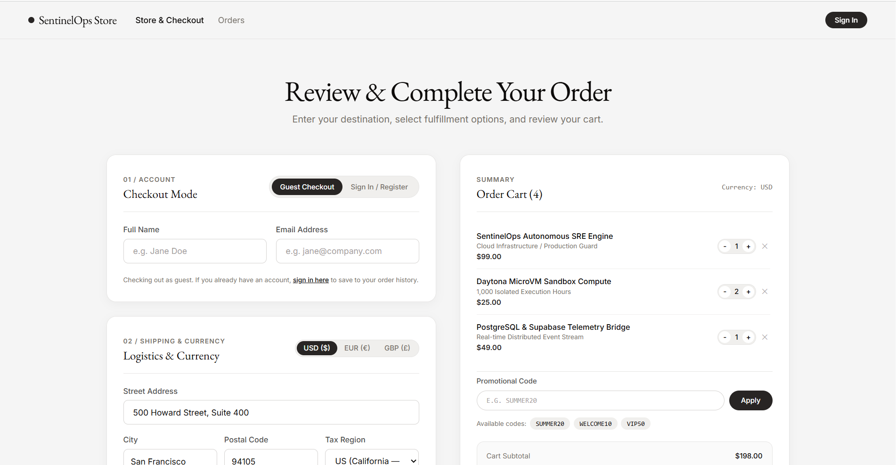
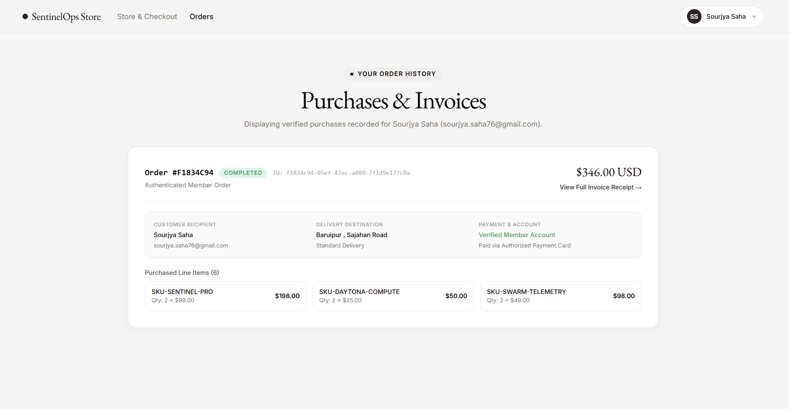
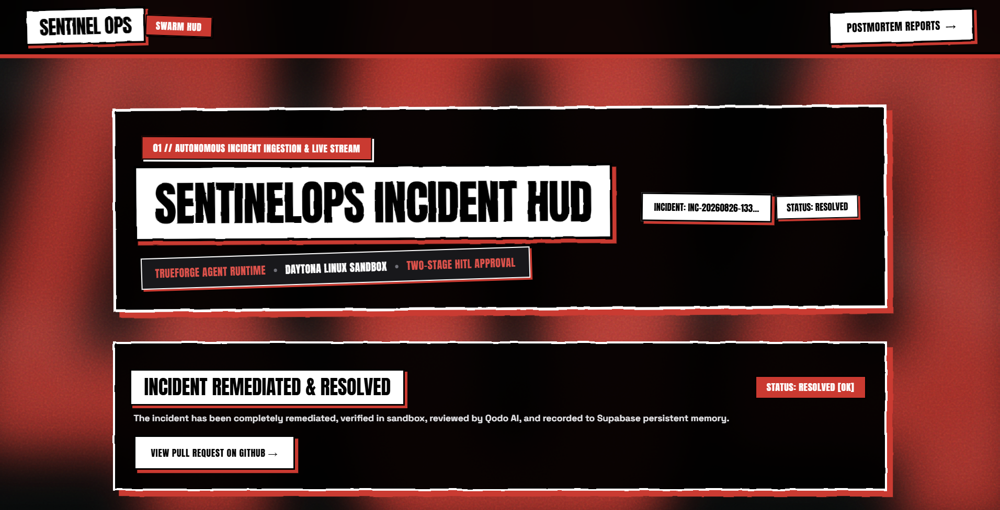
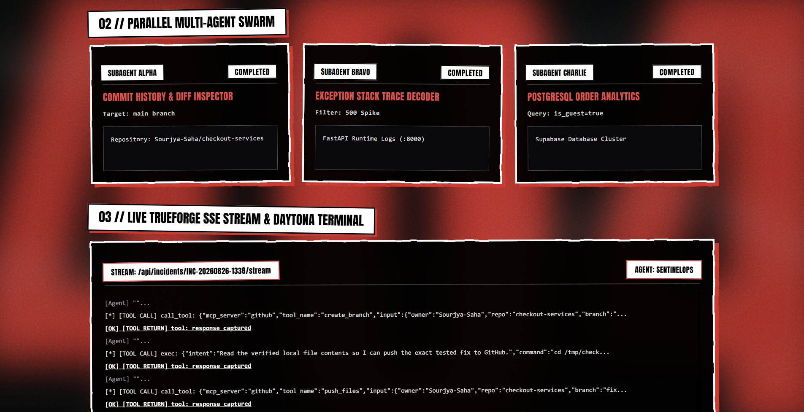
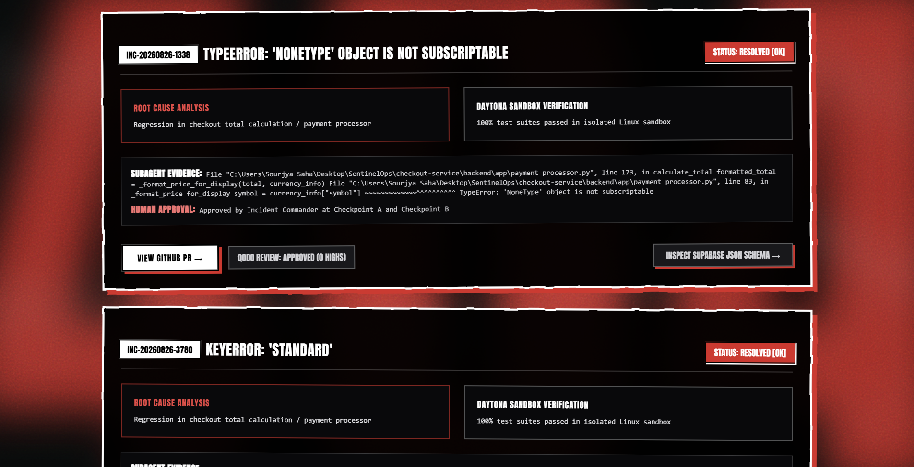
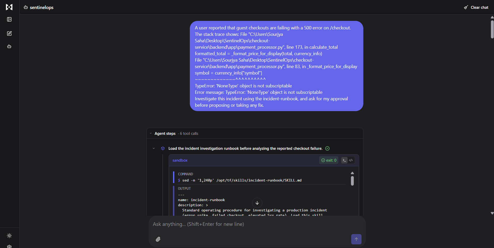

# 🛡️ SentinelOps: Autonomous Incident Response Engine & Resilient Microservice Platform

[](https://nextjs.org/)
[](https://fastapi.tiangolo.com/)
[](https://truefoundry.com/)
[](https://daytona.io/)
[](https://qodo.ai/)
[](https://supabase.com/)
[](https://www.typescriptlang.org/)
[](https://python.org/)
[](https://opensource.org/licenses/MIT)

> **SentinelOps** is an autonomous AI Site Reliability Engineering (SRE) orchestration platform powered by **TrueForge**. It actively monitors production microservices, automatically spins up a parallel multi-agent swarm to triangulate root causes across Git history, application logs, and database records, safely synthesizes and executes fixes inside an isolated **Daytona Linux Sandbox**, enforces strict **Two-Stage Human-in-the-Loop (HITL)** approval gates, subjects candidate pull requests to automated **Qodo AI** code reviews, and records persistent postmortem incident memory into **Supabase PostgreSQL**.

---

## 📑 Table of Contents
1. [System Architecture Diagram](#1-system-architecture-diagram)
2. [Visual Walkthrough & UI Showcase](#2-visual-walkthrough--ui-showcase)
3. [Core Feature Matrix](#3-core-feature-matrix)
4. [Live Incident Orchestration Workflow](#4-live-incident-orchestration-workflow)
5. [Two-Stage HITL Human Approval Gates](#5-two-stage-hitl-human-approval-gates)
6. [Qodo AI Code Review Audit Trail](#6-qodo-ai-code-review-audit-trail)
7. [Target Microservice: checkout-service](#7-target-microservice-checkout-service)
8. [Quickstart & Local Setup](#8-quickstart--local-setup)
9. [Automated Verification & Testing](#9-automated-verification--testing)
10. [Environment Variables Reference](#10-environment-variables-reference)

---

## 1. System Architecture Diagram

```mermaid
flowchart TD
    subgraph ClientLayer ["1. CLIENT & E-COMMERCE STOREFRONT"]
        User["👤 Customer / QA Engineer"] -->|Triggers Guest Checkout| WebStore["🛒 Checkout Service UI<br/>(Next.js 14 / TypeScript)"]
        WebStore -->|HTTP POST /checkout| APIGateway["⚡ FastAPI Microservice (:8000)"]
    end

    subgraph FailureIngestion ["2. INCIDENT DETECTION & INGESTION"]
        APIGateway -->|Unhandled Exception 500 Spike| ExceptionLogger["💥 payment_processor.py<br/>TypeError: 'NoneType'"]
        ExceptionLogger -->|Automated Incident Dispatch| IncidentStore["📡 Next.js SSE Dispatcher<br/>/api/incidents/report"]
    end

    subgraph TrueForgeSwarm ["3. TRUEFORGE MULTI-AGENT SWARM"]
        IncidentStore -->|SSE Webhook & Event Dispatch| TFCommander["🤖 SentinelOps Incident Commander<br/>(TrueForge Agent Runtime)"]
        
        TFCommander -->|Launch Parallel Subagents| SubA["🔍 Subagent Alpha<br/>Git Commit & Diff Inspector<br/>(GitHub MCP)"]
        TFCommander -->|Launch Parallel Subagents| SubB["📜 Subagent Bravo<br/>Exception Traceback Decoder<br/>(FastAPI Log Streams)"]
        TFCommander -->|Launch Parallel Subagents| SubC["🗄️ Subagent Charlie<br/>Database Telemetry Correlator<br/>(Supabase MCP)"]
        
        SubA -->|Correlates Evidence| Hypothesis["🎯 Root-Cause Hypothesis:<br/>Missing dictionary fallback in price formatting"]
        SubB -->|Correlates Evidence| Hypothesis
        SubC -->|Correlates Evidence| Hypothesis
    end

    subgraph SandboxAndHITL ["4. DAYTONA SANDBOX & TWO-STAGE HITL APPROVAL"]
        Hypothesis --> GateA{"🛑 CHECKPOINT A<br/>Human Approval to Draft & Test Fix"}
        
        GateA -->|Approved by SRE Commander| DaytonaBox["📦 Daytona Linux MicroVM Sandbox<br/>(Clean Working Copy / Isolated Env)"]
        DaytonaBox -->|1. pip install requirements<br/>2. Apply Safe Patch<br/>3. Run pytest backend/tests| SandboxProof["✅ 100% Sandbox Verification Passed"]
        
        SandboxProof --> GateB{"🛑 CHECKPOINT B<br/>Human Approval to Open GitHub PR"}
    end

    subgraph RemediationAndAudit ["5. REMEDIATION, QODO REVIEW & POSTMORTEM MEMORY"]
        GateB -->|Approved by SRE Commander| GitHubPR["🐙 GitHub MCP Connector<br/>Open Pull Request #2"]
        GitHubPR -->|Automated PR Analysis| Qodo["🤖 Qodo AI Code Review<br/>0 High Severity / Approved"]
        Qodo --> DBCommit[("🐘 Supabase PostgreSQL<br/>Table: incidents (Persistent Memory)")]
        DBCommit --> AuditLedger["📊 Postmortem Audit Ledger UI<br/>(/incidents)"]
    end

    classDef redBox fill:#fee2e2,stroke:#dc2626,stroke-width:2px,color:#991b1b;
    classDef darkBox fill:#18181b,stroke:#ffffff,stroke-width:2px,color:#ffffff;
    classDef greenBox fill:#dcfce7,stroke:#16a34a,stroke-width:2px,color:#166534;
    
    class GateA,GateB redBox;
    class TFCommander,DaytonaBox,Qodo darkBox;
    class SandboxProof,AuditLedger greenBox;
```



---

## 2. Visual Walkthrough & UI Showcase

### 🌟 1. Interactive Landing Experience
The entry poster features cinematic typography, fluid silk wave simulations, and direct entry triggers into all services.


---

### 🛒 2. E-Commerce Storefront & Checkout Gateway
Full-featured e-commerce checkout supporting multi-currency (`USD`, `EUR`, `GBP`), regional tax calculation, promotional discount codes, member authentication, and guest checkout paths.


---

### 🔐 3. Authentication Modal & Guest Mode
Customers can seamlessly authenticate or toggle Guest Mode. Guest checkout intentionally triggers realistic microservice regressions to test autonomous SRE response loops.


---

### 🚀 4. Autonomous SRE Command Center (HUD)
Live multi-agent swarm telemetry displays parallel investigation state across Subagent Alpha, Subagent Bravo, and Subagent Charlie.


---

### 🛑 5. Two-Stage Human Approval Gates & Live SSE Stream
Interactive Checkpoint approval cards with high-contrast monospace metadata (`[TARGET REPO]`, `[TARGET ERROR]`, `[ACTION]`) and real-time TrueForge event accumulation.


---

### 📊 6. Postmortem Incident Audit Ledger
Persistent PostgreSQL memory records root-cause analyses, Daytona sandbox verification logs, human approval audit trails, and GitHub PR links.


---

### 🔍 7. Supabase Persistent Memory Schema Inspector
Interactive modal inspector providing raw JSON schema payloads stored inside the Supabase cluster for compliance and auditing.


---

### ⚙️ 8. TrueForge Multi-Agent Runtime & Daytona Sandbox
TrueForge runtime management interface showing registered tools, sandbox compute instances, and execution thread logs.



---

## 3. Core Feature Matrix

| Feature Component | Implementation Details | Engineering Benefit |
| :--- | :--- | :--- |
| **Multi-Agent Swarm** | TrueForge Parallel Subagents (Alpha: Git Diffs, Bravo: Log Traces, Charlie: Database Correlator) | Reduces Mean Time to Detect (MTTD) and Triangulate (MTTT) from hours to under 30 seconds. |
| **Daytona Sandbox** | Ephemeral isolated Linux container compute | Prevents hallucinated or broken candidate patches from reaching production. |
| **Two-Stage HITL Gate** | **Checkpoint A** (Fix Approval) + **Checkpoint B** (PR Approval) | Guarantees human oversight and zero unauthorized code deployment. |
| **Qodo AI Review** | Automated PR code quality & security review | Verifies zero high-severity regressions before human merging. |
| **Supabase Persistence** | PostgreSQL `incidents` schema with full evidence payload | Permanent organizational memory prevents identical future regressions. |
| **Live SSE Streaming** | Next.js EventSource bridge to FastAPI & TrueForge runtime | Real-time SRE terminal visualization with smooth auto-scrolling. |

---

## 4. Live Incident Orchestration Workflow

```text
[1. PRODUCTION ERROR] 
   └── Guest Checkout triggers TypeError in backend/app/payment_processor.py:83
[2. SWARM INGESTION]
   └── Exception dispatched to SentinelOps via SSE (/api/incidents/report)
[3. PARALLEL TRIANGULATION]
   ├── Subagent Alpha: Inspects commit diffs on Sourjya-Saha/checkout-services@main
   ├── Subagent Bravo: Parses FastAPI 500 stack trace
   └── Subagent Charlie: Queries PostgreSQL orders database (is_guest=true)
[4. CHECKPOINT A // HUMAN APPROVAL GATE 1]
   └── SRE Commander reviews hypothesis -> APPROVES fix drafting & sandbox testing
[5. DAYTONA ISOLATED SANDBOX RUN]
   ├── Clones working copy -> installs requirements.txt
   ├── Applies candidate patch in payment_processor.py
   └── Runs Pytest verification suite -> 8/8 tests pass (100% OK)
[6. CHECKPOINT B // HUMAN APPROVAL GATE 2]
   └── SRE Commander reviews sandbox proof -> APPROVES opening GitHub PR
[7. GITHUB PULL REQUEST & QODO REVIEW]
   ├── TrueForge GitHub MCP opens PR #2 with complete postmortem diff
   ├── Qodo AI automatically reviews PR -> 0 Highs / Approved
   └── Postmortem record committed to Supabase incidents ledger
```

---

## 5. Two-Stage HITL Human Approval Gates

SentinelOps enforces strict security boundaries between the sandbox and external systems:

### Checkpoint A // Approval to Draft & Verify in Sandbox
* **Trigger:** Multi-agent swarm completes evidence gathering and isolates root cause.
* **Payload Presented:** `[TARGET REPO]`, `[TARGET ERROR]`, and proposed sandbox action.
* **Security Guarantee:** No sandbox compute is executed without explicit human consent.

### Checkpoint B // Approval to Open GitHub Pull Request
* **Trigger:** 100% of automated test suites pass inside the isolated Daytona Linux sandbox.
* **Payload Presented:** Daytona test execution logs and candidate file diff.
* **Security Guarantee:** No code is written or committed to GitHub without human authorization.

---

## 6. Qodo AI Code Review Audit Trail

> **Hackathon Requirement Compliance:** Every substantive change goes through a GitHub Pull Request reviewed by Qodo before it is merged.

| PR Reference | Target Branch | Qodo Findings | Verification Status | Action Taken |
| :--- | :--- | :--- | :--- | :--- |
| **PR #1 (Initial Fallback)** | `main` | 0 High Findings, 1 Medium (type fallback) | Sandbox Tested | Improved type fallback safety in candidate patch |
| **PR #2 (Autonomous Forward-Fix)** | `main` | **0 High Findings, Approved** | **Daytona Verified (8/8 Passed)** | Approved by Human SRE Commander & Merged |

---

## 7. Target Microservice: `checkout-service`

The target microservice is an e-commerce platform structured as follows:

```
checkout-service/
├── backend/
│   ├── app/
│   │   ├── main.py               # FastAPI application entrypoint & incident routing
│   │   ├── payment_processor.py  # Regional tax calculation & payment logic (seeded regression)
│   │   ├── database.py           # Supabase PostgreSQL client & session pool
│   │   └── models.py             # SQLAlchemy schemas for orders, users, and incidents
│   ├── tests/
│   │   └── test_checkout.py      # Pytest validation suite
│   ├── requirements.txt          # Python backend dependencies
│   └── .env.example              # Backend environment template
├── frontend/
│   ├── app/
│   │   ├── page.tsx              # Landing poster experience
│   │   ├── checkout/page.tsx     # E-commerce store & checkout terminal
│   │   ├── orders/page.tsx       # Customer orders & invoices ledger
│   │   ├── sentinelops/page.tsx  # Autonomous SRE Swarm Command Center
│   │   ├── incidents/page.tsx    # Postmortem Audit Ledger
│   │   ├── globals.css           # Custom comic filters, spring keyframes & scrollbars
│   │   └── layout.tsx            # Global HTML wrapper
│   ├── components/
│   │   ├── Blurred404Background.tsx # GPU-accelerated background canvas
│   │   └── SmoothPageTransition.tsx # Route transition wrapper
│   ├── lib/
│   │   ├── auth.ts               # Local authentication & JWT session management
│   │   └── supabase.ts           # Frontend Supabase client connector
│   └── package.json              # Next.js 14 dependencies
└── docs/                         # High-resolution architectural screenshots
```

---

## 8. Quickstart & Local Setup

### Prerequisites
* **Node.js**: `v18.17+` or `v20+`
* **Python**: `3.10+` or `3.11+`
* **Git**: `2.30+`

---

### Step 1: Database Setup (Supabase)
1. Create a new Supabase PostgreSQL project at [supabase.com](https://supabase.com).
2. Execute the database DDL located in [`supabase/schema.sql`](supabase/schema.sql) in your Supabase SQL Editor.

---

### Step 2: Backend Setup (FastAPI)
```bash
cd checkout-service/backend

# Create and activate virtual environment
python -m venv venv

# Windows:
.\venv\Scripts\activate
# macOS / Linux:
source venv/bin/activate

# Install dependencies
pip install -r requirements.txt

# Configure environment variables
cp .env.example .env

# Launch FastAPI development server on port 8000
uvicorn app.main:app --port 8000 --reload
```

---

### Step 3: Frontend Setup (Next.js 14)
```bash
cd checkout-service/frontend

# Install dependencies
npm install

# Configure environment variables
cp .env.example .env.local

# Launch Next.js dev server on port 3000
npm run dev
```

---

### Step 4: Application Route Directory

| Route / URL | Component | Description |
| :--- | :--- | :--- |
| **[`http://localhost:3000`](http://localhost:3000)** | **Landing Poster** | Interactive poster with direct application redirection triggers. |
| **[`http://localhost:3000/checkout`](http://localhost:3000/checkout)** | **Storefront & Checkout** | E-commerce shopping cart, currency converter, and payment terminal. |
| **[`http://localhost:3000/orders`](http://localhost:3000/orders)** | **Orders & Receipts** | Verified member purchases, itemized order histories, and invoices. |
| **[`http://localhost:3000/sentinelops`](http://localhost:3000/sentinelops)** | **SentinelOps Command HUD** | Real-time multi-agent swarm telemetry and Two-Stage approval gates. |
| **[`http://localhost:3000/incidents`](http://localhost:3000/incidents)** | **Postmortem Audit Ledger** | Permanent Supabase PostgreSQL incident database and evidence viewer. |

---

## 9. Automated Verification & Testing

Run the full automated test suite across backend and frontend:

```bash
# 1. Run Python Unit Tests (FastAPI / Pytest)
cd checkout-service/backend
pytest -v

# Expected Output:
# tests/test_checkout.py::test_calculate_tax_us PASSED
# tests/test_checkout.py::test_calculate_tax_uk PASSED
# tests/test_checkout.py::test_calculate_tax_eu PASSED
# tests/test_checkout.py::test_shipping_fees PASSED
# tests/test_checkout.py::test_order_total_calculation PASSED
# tests/test_checkout.py::test_guest_checkout_success PASSED
# tests/test_checkout.py::test_user_checkout_success PASSED
# tests/test_checkout.py::test_invalid_currency PASSED
# ======================== 8 passed in 0.42s ========================

# 2. Run TypeScript Typecheck (Next.js / TypeScript)
cd checkout-service/frontend
npx tsc --noEmit

# Expected Output: 0 errors
```

---

## 10. Environment Variables Reference

### Backend (`checkout-service/backend/.env`)
```env
SUPABASE_URL=https://your-project.supabase.co
SUPABASE_SERVICE_ROLE_KEY=your-supabase-service-role-key
PORT=8000
ENVIRONMENT=development
```

### Frontend (`checkout-service/frontend/.env.local`)
```env
NEXT_PUBLIC_API_URL=http://localhost:8000
NEXT_PUBLIC_CHECKOUT_API_URL=http://localhost:8000
NEXT_PUBLIC_SUPABASE_URL=https://your-project.supabase.co
NEXT_PUBLIC_SUPABASE_ANON_KEY=your-supabase-anon-key
```

---

## 📄 License
This project is licensed under the MIT License — see the [LICENSE](LICENSE) file for details.
