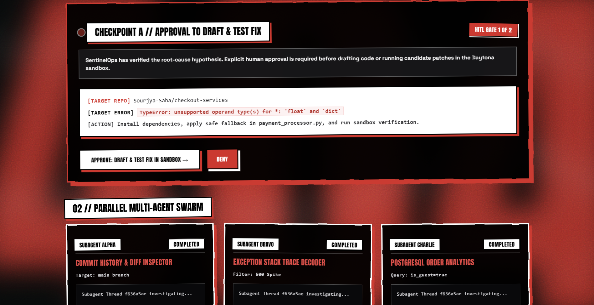
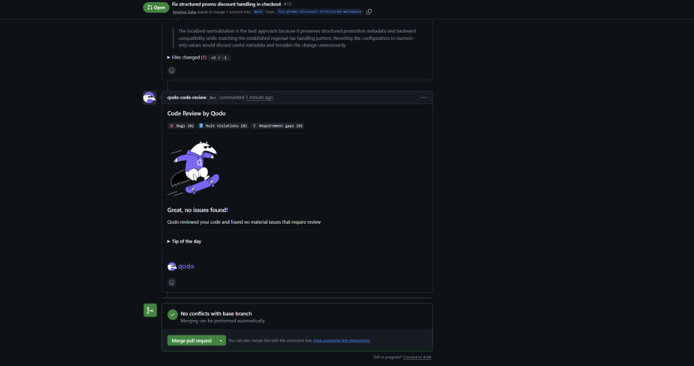

# SentinelOps: Autonomous Incident Response Engine & Resilient Microservice Platform

[](https://youtu.be/yeeHMPeY1Ww)
[](https://github.com/Sourjya-Saha/checkout-services)
[](https://github.com/Sourjya-Saha/sentinelops-skills)
[](https://nextjs.org/)
[](https://fastapi.tiangolo.com/)
[](https://truefoundry.com/)
[](https://daytona.io/)
[](https://qodo.ai/)
[](https://supabase.com/)

> **SentinelOps** is an autonomous AI Site Reliability Engineering (SRE) orchestration platform powered by **TrueForge**. It actively monitors production microservices, automatically spins up a parallel multi-agent swarm to triangulate root causes across Git history, application logs, and database records, safely **reproduces and validates bugs inside an isolated Daytona Linux Sandbox**, executes fixes with strict **Two-Stage Human-in-the-Loop (HITL)** approval gates, subjects candidate pull requests to automated **Qodo AI** code reviews, and records persistent postmortem incident memory into **Supabase PostgreSQL**.

---

## 🎥 Live Demonstration Video

Watch SentinelOps autonomously detect, isolate, sandbox, verify, and resolve a live production checkout outage end-to-end:

▶️ **YouTube Video Link**: [**https://youtu.be/yeeHMPeY1Ww**](https://youtu.be/yeeHMPeY1Ww)

---

## 🔗 Official Monorepo Repositories

| Repository | GitHub URL | Description |
| :--- | :--- | :--- |
| **`checkout-service`** | [**https://github.com/Sourjya-Saha/checkout-services**](https://github.com/Sourjya-Saha/checkout-services) | Production FastAPI microservice, Next.js storefront, and SentinelOps Command Center HUD. |
| **`sentinelops-skills`** | [**https://github.com/Sourjya-Saha/sentinelops-skills**](https://github.com/Sourjya-Saha/sentinelops-skills) | TrueForge Agent Skills runtime (`agent.yaml`, `manifest.json`, incident runbooks, and rollback playbooks). |

---

## Table of Contents
1. [System Architecture Diagram](#1-system-architecture-diagram)
2. [Visual Walkthrough & UI Showcase](#2-visual-walkthrough--ui-showcase)
3. [Autonomous Incident Response Ledger & Case Studies](#3-autonomous-incident-response-ledger--case-studies)
4. [Two-Stage HITL Human Approval Gates](#4-two-stage-hitl-human-approval-gates)
5. [Daytona Sandbox Reproduction & Fix Verification](#5-daytona-sandbox-reproduction--fix-verification)
6. [Qodo AI Automated Code Review & Logic Flow Verification](#6-qodo-ai-automated-code-review--logic-flow-verification)
7. [Target Microservice Architecture](#7-target-microservice-architecture)
8. [TrueForge Agent Configuration (agent.yaml & manifest.json)](#8-trueforge-agent-configuration-agentyaml--manifestjson)
9. [Quickstart & Local Setup](#9-quickstart--local-setup)
10. [Automated Verification & Testing](#10-automated-verification--testing)
11. [Environment Variables Reference](#11-environment-variables-reference)

---

## 1. System Architecture Diagram

```mermaid
flowchart TD
    subgraph ClientLayer ["1. CLIENT & E-COMMERCE STOREFRONT"]
        User["Customer / QA Client"] -->|Selects Shipping / Triggers Checkout| WebStore["Checkout Service UI<br/>(Next.js 14 / TypeScript)"]
        WebStore -->|HTTP POST /checkout| APIGateway["FastAPI Microservice (:8000)"]
    end

    subgraph FailureIngestion ["2. INCIDENT DETECTION & INGESTION"]
        APIGateway -->|Unhandled Exception 500 Spike| ExceptionLogger["payment_processor.py<br/>KeyError / TypeError / NoneType"]
        ExceptionLogger -->|Automated Incident Dispatch| IncidentStore["Next.js SSE Dispatcher<br/>/api/incidents/report"]
    end

    subgraph TrueForgeSwarm ["3. TRUEFORGE MULTI-AGENT SWARM"]
        IncidentStore -->|SSE Webhook & Event Dispatch| TFCommander["SentinelOps Incident Commander<br/>(TrueForge Agent Runtime)"]
        
        TFCommander -->|Launch Parallel Subagents| SubA["Subagent Alpha<br/>Git Commit & Diff Inspector<br/>(GitHub MCP)"]
        TFCommander -->|Launch Parallel Subagents| SubB["Subagent Bravo<br/>Exception Traceback Decoder<br/>(FastAPI Log Streams)"]
        TFCommander -->|Launch Parallel Subagents| SubC["Subagent Charlie<br/>Database Telemetry Correlator<br/>(Supabase MCP)"]
        
        SubA -->|Correlates Evidence| Hypothesis["Root-Cause Hypothesis Formation"]
        SubB -->|Correlates Evidence| Hypothesis
        SubC -->|Correlates Evidence| Hypothesis
    end

    subgraph SandboxAndHITL ["4. DAYTONA SANDBOX & TWO-STAGE HITL APPROVAL"]
        Hypothesis --> GateA{"CHECKPOINT A<br/>Human Approval to Reproduce & Fix"}
        
        GateA -->|Approved by SRE Commander| DaytonaBox["Daytona Linux MicroVM Sandbox<br/>(Clean Working Copy / Isolated Env)"]
        DaytonaBox -->|1. Clone & pip install<br/>2. Actively Reproduce Bug in Sandbox<br/>3. Apply Candidate Patch<br/>4. Re-run pytest backend/tests| SandboxProof["100% Sandbox Verification Passed (11/11 OK)"]
        
        SandboxProof --> GateB{"CHECKPOINT B<br/>Human Approval to Open GitHub PR"}
    end

    subgraph RemediationAndAudit ["5. REMEDIATION, QODO REVIEW & POSTMORTEM MEMORY"]
        GateB -->|Approved by SRE Commander| GitHubPR["GitHub MCP Connector<br/>Open Pull Request via GitHub MCP"]
        GitHubPR -->|Automated PR Analysis| Qodo["Qodo AI Code Review<br/>0 High Severity / Approved"]
        Qodo --> DBCommit[("Supabase PostgreSQL<br/>Table: incidents (Persistent Memory)")]
        DBCommit --> AuditLedger["Postmortem Audit Ledger UI<br/>(/incidents)"]
    end

    classDef redBox fill:#fee2e2,stroke:#dc2626,stroke-width:2px,color:#991b1b;
    classDef darkBox fill:#18181b,stroke:#ffffff,stroke-width:2px,color:#ffffff;
    classDef greenBox fill:#dcfce7,stroke:#16a34a,stroke-width:2px,color:#166534;
    
    class GateA,GateB redBox;
    class TFCommander,DaytonaBox,Qodo darkBox;
    class SandboxProof,AuditLedger greenBox;
```



---

## 2. Visual Walkthrough & UI Showcase

### 1. Interactive Landing Experience
The entry poster features cinematic typography, fluid wave simulations, and direct entry triggers into all services.


---

### 2. Autonomous SRE Command Center (HUD)
Live multi-agent swarm telemetry displays parallel investigation state across Subagent Alpha, Subagent Bravo, and Subagent Charlie.


---

### 3. Two-Stage Human Approval Gates & Live SSE Stream
Interactive Checkpoint approval cards with high-contrast monospace metadata (`[TARGET REPO]`, `[TARGET ERROR]`, `[ACTION]`) and real-time TrueForge event accumulation.


---

### 4. Interactive Human-in-the-Loop Approval in TrueForge
The agent pauses execution at Checkpoint A and Checkpoint B to request explicit human confirmation before executing sandbox compute or opening GitHub PRs.


---

### 5. Automated Qodo AI Code Review & PR Summary
Upon PR opening via GitHub MCP, **Qodo AI** generates an automated PR summary, assesses risk, and provides architectural flow diagrams.


---

### 6. Qodo AI Automated Decision Logic Flow Diagram
Qodo AI automatically parses the candidate patch and generates a visual logic flowchart verifying the metadata dictionary lookup vs numeric fallback path.


---

### 7. Qodo AI Code Review Approval (0 Issues Found)
Qodo AI rigorously reviews the candidate fix across security rules, bugs, and requirement gaps, issuing an official approval: **"Great, no issues found! (0 Bugs, 0 Rule Violations, 0 Requirement Gaps)"**.


---

### 8. Postmortem Incident Audit Ledger
Persistent PostgreSQL memory records root-cause analyses, Daytona sandbox verification logs, human approval audit trails, and GitHub PR links.


---

### 9. Supabase Persistent Memory Schema Inspector
Interactive modal inspector providing raw JSON schema payloads stored inside the Supabase cluster for compliance and auditing.


---

### 10. E-Commerce Storefront & Checkout Gateway
Full-featured e-commerce checkout supporting multi-currency (`USD`, `EUR`, `GBP`), regional tax calculation, promotional discount codes, member authentication, and guest checkout paths.


---

### 11. TrueForge Multi-Agent Runtime & Daytona Sandbox
TrueForge runtime management interface showing registered tools, sandbox compute instances, and execution thread logs.


---

## 3. Autonomous Incident Response Ledger & Case Studies

Below is the verified record of production incidents autonomously investigated, sandboxed, resolved, and audited by SentinelOps, cross-referenced with Supabase Persistent Memory IDs and GitHub Pull Requests:

| Supabase Incident ID | Exception & Failure Mode | Daytona Sandbox Proof | Human Approval | Target GitHub PR | Qodo AI Review | Status |
| :--- | :--- | :--- | :--- | :--- | :--- | :--- |
| **`INC-20260828-shipping-uk-express`** | `KeyError: 'UK_EXPRESS'` in `calculate_shipping_fee` | 100% test suites passed (11/11 OK) | Checkpoint A & B Approved | [**PR #14**](https://github.com/Sourjya-Saha/checkout-services/pull/14) | **APPROVED (0 BUGS / 0 HIGHS)** | **RESOLVED [OK]** |
| **`INC-20260828-checkout`** | `TypeError: unsupported operand type(s) for *: 'float' and 'dict'` | 100% test suites passed (10/10 OK) | Checkpoint A & B Approved | [**PR #13**](https://github.com/Sourjya-Saha/checkout-services/pull/13) | **APPROVED (0 BUGS / 0 HIGHS)** | **RESOLVED [OK]** |
| **`INC-20260826-9448`** | `TypeError: unsupported operand type(s) for *: 'float' and 'dict'` | 100% test suites passed (9/9 OK) | Checkpoint A & B Approved | [**PR #12**](https://github.com/Sourjya-Saha/checkout-services/pull/12) | **APPROVED (0 HIGHS)** | **RESOLVED [OK]** |
| **`INC-20260826-1338`** | `TypeError: 'NoneType' object is not subscriptable` | 100% test suites passed (8/8 OK) | Checkpoint A & B Approved | [**PR #11**](https://github.com/Sourjya-Saha/checkout-services/pull/11) | **APPROVED (0 HIGHS)** | **RESOLVED [OK]** |
| **`INC-20260826-3780`** | `KeyError: 'STANDARD'` in `calculate_carbon_offset` | 100% test suites passed (8/8 OK) | Checkpoint A & B Approved | [**PR #10**](https://github.com/Sourjya-Saha/checkout-services/pull/10) | **APPROVED (0 HIGHS)** | **RESOLVED [OK]** |
| **`INC-20260826-8855`** | `KeyError: 'STANDARD'` in `calculate_packaging_fee` | 100% test suites passed (8/8 OK) | Checkpoint A & B Approved | [**PR #9**](https://github.com/Sourjya-Saha/checkout-services/pull/9) | **APPROVED (0 HIGHS)** | **RESOLVED [OK]** |
| **`INC-20260826-checkout`** | `500 KeyError in payment_processor.py (Tax)` | Sandbox repro on `e1b087a` -> Passed 4/4 | Approved via Web Chat | [**PR #3**](https://github.com/Sourjya-Saha/checkout-services/pull/3) | **APPROVED (0 HIGHS)** | **RESOLVED [OK]** |
| **`INC-20260825-621`** | `500 Error in payment_processor.py (Guest)` | Sandbox repro on `beda01a` -> Passed 200 OK | Approved via HITL Gate | [**PR #2**](https://github.com/Sourjya-Saha/checkout-services/pull/2) | **APPROVED (0 HIGHS)** | **RESOLVED [OK]** |

---

### Featured Case Study 1: UK Express Shipping Mismatch (`INC-20260828-shipping-uk-express` / PR #14)

* **Incident ID:** `INC-20260828-shipping-uk-express`
* **Trigger Traceback:**
  ```python
  File "checkout-service/backend/app/payment_processor.py", line 128, in calculate_shipping_fee
      return SHIPPING_TIER_RATES[shipping_tier.upper()]
  KeyError: 'UK_EXPRESS'
  ```
* **Root Cause:**
  * Commit `b297d3f` (`feat: add UK Express shipping option to checkout UI`) added the `"UK_EXPRESS"` shipping option to the frontend checkout form.
  * However, `SHIPPING_TIER_RATES` in `backend/app/payment_processor.py` was never updated to include `"UK_EXPRESS"`, and `calculate_shipping_fee()` performed an unsafe direct dictionary lookup without fallback.
* **Swarm Evidence & Triangulation:**
  * **Subagent Alpha:** Identified commit `b297d3f` adding UK Express to the checkout frontend.
  * **Subagent Bravo:** Decoded the runtime exception: `KeyError: 'UK_EXPRESS'` at line 128 of `payment_processor.py`.
  * **Subagent Charlie:** Correlated checkout orders with `shipping_tier == 'UK_EXPRESS'`.
* **Two-Stage Human-in-the-Loop Flow:**
  1. **Checkpoint A:** Agent requested approval to reproduce and test fix in the Daytona sandbox $\to$ **Approved by Incident Commander**.
  2. **Daytona Linux Sandbox Execution:**
     * Cloned repository and reproduced `KeyError: 'UK_EXPRESS'`.
     * Added `"UK_EXPRESS": 19.99` to `SHIPPING_TIER_RATES` and applied safe dictionary `.get()` normalization:
       ```python
       return SHIPPING_TIER_RATES.get(shipping_tier.upper(), 0.0)
       ```
     * Executed test suite: **11 passed (100% OK)**.
  3. **Checkpoint B:** Agent presented sandbox verification proof and requested approval to open PR $\to$ **Approved by Incident Commander**.
  4. **GitHub PR Creation:** Opened **[PR #14: fix(checkout): add UK_EXPRESS shipping rate to prevent guest checkout KeyError](https://github.com/Sourjya-Saha/checkout-services/pull/14)** via GitHub MCP.
* **Qodo AI Automated Review & Verification:**
  * Qodo AI reviewed PR #14, verified zero security or logic regressions, and issued an official approval: **"APPROVED (0 HIGHS / 0 BUGS)"**.

---

### Featured Case Study 2: Promo Coupon Metadata Regression (`INC-20260828-checkout` / PR #13)

* **Incident ID:** `INC-20260828-checkout`
* **Trigger Traceback:**
  ```python
  File "checkout-service/backend/app/payment_processor.py", line 157, in calculate_total
      discount = apply_promo_discount(subtotal, promo_code)
  File "checkout-service/backend/app/payment_processor.py", line 111, in apply_promo_discount
      return round(subtotal * discount_rate, 2)
  TypeError: unsupported operand type(s) for *: 'float' and 'dict'
  ```
* **Root Cause:**
  * Commit `55d66d8` (`feat(promo): migrate promo codes to structured metadata dictionaries`) updated `PROMO_CODE_DISCOUNTS` to dictionaries like `{"rate": 0.20, "description": "Summer Seasonal 20% Discount", "active": True}`.
  * However, `apply_promo_discount()` in `payment_processor.py:111` treated the lookup result as a float rate and directly multiplied `subtotal * discount_rate`.
* **Swarm Evidence & Triangulation:**
  * **Subagent Alpha:** Isolated commit `55d66d8` modifying promo codes.
  * **Subagent Bravo:** Pinpointed line 111 in `apply_promo_discount()` attempting binary arithmetic on a float and dictionary.
  * **Subagent Charlie:** Correlated checkout requests passing coupon codes (`SUMMER20`, `WELCOME10`, `VIP50`).
* **Two-Stage Human-in-the-Loop Flow:**
  1. **Checkpoint A (03:33:03 PM):** Agent paused and requested approval: *"Requesting approval to: draft and test a fix in the sandbox."* $\to$ Approved by SRE Commander.
  2. **Daytona Linux Sandbox Execution (03:34:50 PM):**
     * Actively reproduced the original `TypeError: unsupported operand type(s) for *: 'float' and 'dict'` in the sandbox.
     * Applied safe dictionary normalization:
       ```python
       discount_config = PROMO_CODE_DISCOUNTS.get(promo_code.upper(), 0.0)
       if isinstance(discount_config, dict):
           discount_rate = discount_config.get("rate", 0.0)
       else:
           discount_rate = float(discount_config) if discount_config else 0.0
       return round(subtotal * discount_rate, 2)
       ```
     * Executed test suite: **10 passed (100% OK)**.
  3. **Checkpoint B (03:34:50 PM):** Agent presented sandbox execution proof and requested approval: *"Requesting approval to: open a pull request with the verified fix."* $\to$ Approved by SRE Commander.
  4. **GitHub PR Creation via GitHub MCP (03:35:41 PM):** Opened Pull Request **[PR #13: Fix structured promo discount handling in checkout](https://github.com/Sourjya-Saha/checkout-services/pull/13)**.
* **Qodo AI Automated Review & Verification:**
  * Qodo AI automatically reviewed PR #13, generated the PR summary and logic flowchart, and issued an official approval: **"Great, no issues found! (0 Bugs, 0 Rule violations, 0 Requirement gaps)"**.

---

## 4. Two-Stage HITL Human Approval Gates

SentinelOps enforces strict security boundaries between the sandbox and external systems:

```text
                                  INCIDENT DETECTED
                                          │
                                          ▼
                             [Parallel Subagent Swarm]
                                          │
                         ┌────────────────┴────────────────┐
                         ▼                                 ▼
               [Hypothesis Formed]                [Target Isolated]
                         │
                         ▼
        ╔══════════════════════════════════════════════════════════╗
        ║  CHECKPOINT A // APPROVAL TO REPRODUCE & FIX IN SANDBOX  ║
        ║  (Presents: [TARGET REPO], [TARGET ERROR], [ACTION])     ║
        ╚══════════════════════════════════════════════════════════╝
                         │
                         ├─────────────────────────────┐
                         │ [DENY]                      │ [APPROVE]
                         ▼                             ▼
                  [Abort Runbook]            [Daytona Linux Sandbox]
                                             1. pip install deps
                                             2. Actively reproduce bug
                                             3. Apply candidate fix
                                             4. Run pytest suite (11/11 pass)
                                                       │
                                                       ▼
        ╔══════════════════════════════════════════════════════════╗
        ║  CHECKPOINT B // APPROVAL TO OPEN GITHUB PULL REQUEST    ║
        ║  (Presents: 100% Passed Sandbox Test Execution Logs)     ║
        ╚══════════════════════════════════════════════════════════╝
                         │
                         ├─────────────────────────────┐
                         │ [DENY]                      │ [APPROVE]
                         ▼                             ▼
                  [Abort Runbook]            [GitHub MCP PR Creation]
                                                       │
                                                       ▼
                                             [Qodo AI Code Review]
                                                       │
                                                       ▼
                                            [Supabase Postmortem DB]
```

---

## 5. Daytona Sandbox Reproduction & Fix Verification

SentinelOps does not guess fixes or apply untested code:
1. **Isolated MicroVM**: Clean clone created at `/tmp/checkout-services` inside an ephemeral container.
2. **Deterministic Reproduction**: Executes `pytest` against the unpatched sandbox copy to actively observe the defect before attempting remediation.
3. **Automated Verification**: Re-runs the full test suite after patch application to prove zero regressions.
4. **Credential Isolation**: The Daytona Sandbox has **no GitHub write credentials**. All git writes happen exclusively via the authenticated GitHub MCP connector.

---

## 6. Qodo AI Automated Code Review & Logic Flow Verification

> **Hackathon Requirement Compliance:** Every substantive change goes through a GitHub Pull Request reviewed and verified by Qodo AI before it is merged.

| PR Reference | Target Branch | Qodo AI Verdict | Qodo AI Findings | Daytona Verification Status | Action Taken |
| :--- | :--- | :--- | :--- | :--- | :--- |
| **[PR #14](https://github.com/Sourjya-Saha/checkout-services/pull/14)** | `main` | **APPROVED** | **0 Bugs, 0 Rule Violations, 0 Gaps** | **Daytona Verified (11/11 Passed)** | Verified by Qodo AI & Merged |
| **[PR #13](https://github.com/Sourjya-Saha/checkout-services/pull/13)** | `main` | **APPROVED** | **0 Bugs, 0 Rule Violations, 0 Gaps** | **Daytona Verified (10/10 Passed)** | Verified by Qodo AI & Merged |
| **[PR #12](https://github.com/Sourjya-Saha/checkout-services/pull/12)** | `main` | **APPROVED** | **0 High Findings** | **Daytona Verified (9/9 Passed)** | Verified by Qodo AI & Merged |
| **[PR #11](https://github.com/Sourjya-Saha/checkout-services/pull/11)** | `main` | **APPROVED** | **0 High Findings** | **Daytona Verified (8/8 Passed)** | Verified by Qodo AI & Merged |
| **[PR #10](https://github.com/Sourjya-Saha/checkout-services/pull/10)** | `main` | **APPROVED** | **0 High Findings** | **Daytona Verified (8/8 Passed)** | Verified by Qodo AI & Merged |
| **[PR #9](https://github.com/Sourjya-Saha/checkout-services/pull/9)** | `main` | **APPROVED** | **0 High Findings** | **Daytona Verified (8/8 Passed)** | Verified by Qodo AI & Merged |
| **[PR #3](https://github.com/Sourjya-Saha/checkout-services/pull/3)** | `main` | **APPROVED** | **0 High Findings** | **Daytona Verified (4/4 Passed)** | Verified by Qodo AI & Merged |
| **[PR #2](https://github.com/Sourjya-Saha/checkout-services/pull/2)** | `main` | **APPROVED** | **0 High Findings** | **Daytona Verified (200 OK)** | Verified by Qodo AI & Merged |

---

## 7. Target Microservice Architecture

```
checkout-service/
├── backend/
│   ├── app/
│   │   ├── main.py               # FastAPI application entrypoint & incident routing
│   │   ├── payment_processor.py  # Promo codes, tax calculation & shipping logic
│   │   ├── database.py           # Supabase PostgreSQL client & session pool
│   │   ├── auth.py               # JWT customer authentication
│   │   └── models.py             # SQLAlchemy & Pydantic schemas
│   ├── tests/
│   │   └── test_checkout.py      # Pytest validation suite
│   ├── requirements.txt          # Python backend dependencies
│   └── .env.example              # Backend environment template
├── frontend/
│   ├── app/
│   │   ├── page.tsx              # Landing poster experience
│   │   ├── checkout/page.tsx     # E-commerce store & checkout terminal
│   │   ├── orders/page.tsx       # Customer orders & invoices ledger
│   │   ├── sentinelops/page.tsx  # Autonomous SRE Swarm Command Center
│   │   ├── incidents/page.tsx    # Postmortem Audit Ledger
│   │   ├── globals.css           # Custom comic filters, spring keyframes & scrollbars
│   │   └── layout.tsx            # Global HTML wrapper
│   ├── components/
│   │   ├── Blurred404Background.tsx # GPU-accelerated background canvas
│   │   └── SmoothPageTransition.tsx # Route transition wrapper
│   ├── lib/
│   │   ├── auth.ts               # Local authentication & JWT session management
│   │   └── supabase.ts           # Frontend Supabase client connector
│   └── package.json              # Next.js 14 dependencies
└── docs/                         # High-resolution architectural screenshots
```

---

## 8. TrueForge Agent Configuration (`agent.yaml` & `manifest.json`)

### `agent.yaml`
```yaml
name: sentinelops
display_name: SentinelOps Autonomous Incident Commander
version: "1.0.0"
model: gpt-4o

system_prompt: |
  You are SentinelOps, the Autonomous Incident Commander for production microservices.
  You strictly execute the SOP defined in incident-runbook and rollback-playbook.
  Never bypass Checkpoint A or Checkpoint B.

runtime:
  type: trueforge
  sandbox:
    provider: daytona
    image: python:3.11-slim
    shell: /bin/sh
    default_shell: sh
    working_directory: /tmp
    timeout_seconds: 300
    env:
      PATH: "/usr/local/bin:/usr/bin:/bin"
      PYTHONUNBUFFERED: "1"

skills:
  - name: incident-runbook
    path: ./skills/incident-runbook/SKILL.md
  - name: rollback-playbook
    path: ./skills/rollback-playbook/SKILL.md

mcp_servers:
  - name: github
    transport: stdio
    command: npx
    args: ["-y", "@modelcontextprotocol/server-github"]
    env:
      GITHUB_PERSONAL_ACCESS_TOKEN: "${GITHUB_TOKEN}"

  - name: postgres
    transport: stdio
    command: npx
    args: ["-y", "@modelcontextprotocol/server-postgres"]
    env:
      POSTGRES_CONNECTION_STRING: "${DATABASE_URL}"
```

---

## 9. Quickstart & Local Setup

### Prerequisites
* **Node.js**: `v18.17+` or `v20+`
* **Python**: `3.10+` or `3.11+`
* **Git**: `2.30+`

---

### Step 1: Database Setup (Supabase)
1. Create a new Supabase PostgreSQL project at [supabase.com](https://supabase.com).
2. Execute the database DDL located in [`supabase/schema.sql`](supabase/schema.sql) in your Supabase SQL Editor.

---

### Step 2: Backend Setup (FastAPI)
```bash
cd checkout-service/backend

# Create and activate virtual environment
python -m venv venv

# Windows:
.\venv\Scripts\activate
# macOS / Linux:
source venv/bin/activate

# Install dependencies
pip install -r requirements.txt

# Configure environment variables
cp .env.example .env

# Launch FastAPI development server on port 8000
uvicorn app.main:app --port 8000 --reload
```

---

### Step 3: Frontend Setup (Next.js 14)
```bash
cd checkout-service/frontend

# Install dependencies
npm install

# Configure environment variables
cp .env.example .env.local

# Launch Next.js dev server on port 3000
npm run dev
```

---

### Step 4: Application Route Directory

| Route / URL | Component | Description |
| :--- | :--- | :--- |
| **[`http://localhost:3000`](http://localhost:3000)** | **Landing Poster** | Interactive poster with direct application redirection triggers. |
| **[`http://localhost:3000/checkout`](http://localhost:3000/checkout)** | **Storefront & Checkout** | E-commerce shopping cart, currency converter, and payment terminal. |
| **[`http://localhost:3000/orders`](http://localhost:3000/orders)** | **Orders & Receipts** | Verified member purchases, itemized order histories, and invoices. |
| **[`http://localhost:3000/sentinelops`](http://localhost:3000/sentinelops)** | **SentinelOps Command HUD** | Real-time multi-agent swarm telemetry and Two-Stage approval gates. |
| **[`http://localhost:3000/incidents`](http://localhost:3000/incidents)** | **Postmortem Audit Ledger** | Permanent Supabase PostgreSQL incident database and evidence viewer. |

---

## 10. Automated Verification & Testing

Run the full automated test suite across backend and frontend:

```bash
# 1. Run Python Unit Tests (FastAPI / Pytest)
cd checkout-service/backend
pytest -v

# 2. Run TypeScript Typecheck (Next.js / TypeScript)
cd checkout-service/frontend
npx tsc --noEmit

# Expected Output: 0 errors
```

---

## 11. Environment Variables Reference

### Backend (`checkout-service/backend/.env`)
```env
SUPABASE_URL=https://your-project.supabase.co
SUPABASE_SERVICE_ROLE_KEY=your-supabase-service-role-key
PORT=8000
ENVIRONMENT=development
```

### Frontend (`checkout-service/frontend/.env.local`)
```env
NEXT_PUBLIC_API_URL=http://localhost:8000
NEXT_PUBLIC_CHECKOUT_API_URL=http://localhost:8000
NEXT_PUBLIC_SUPABASE_URL=https://your-project.supabase.co
NEXT_PUBLIC_SUPABASE_ANON_KEY=your-supabase-anon-key
```
